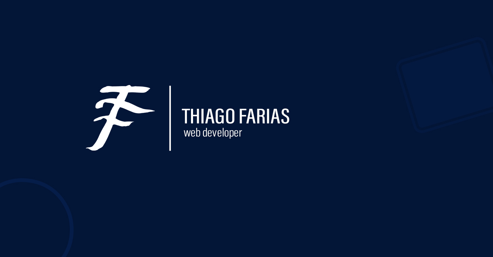

## Hello!👋 
Sou Thiago Farias e desde sempre gosto muito de tecnologia. Tive meu primeiro contato com programação em 2017, assim que ingressei na faculdade de Análise e Desenvolvimento de Sistemas, e desde sempre tenho dado foco para a área de desenvolvimento. No começo ainda tinha um pouco de confusão em qual área da programação/desenvolvimento me colocar, mas depois de um tempo vi que o desenvolvimento web era o que eu mais tinha afinidade. Juntei algumas habilidades de design gráfico que eu já tinha e comecei a aprender e me aprimorar na área de desenvolvimento web.

Hoje já entendo de algumas tecnologias voltadas para frontend e outras para backend. Além disso, nunca parei de praticar minhas habilidades com design gráfico, web design e afins!

### 📈 GitHub stats

### 👨‍💻 Technologies of my everyday life

  
  
  
  
  
  

### 🛠️ Other skills

  
  
  

